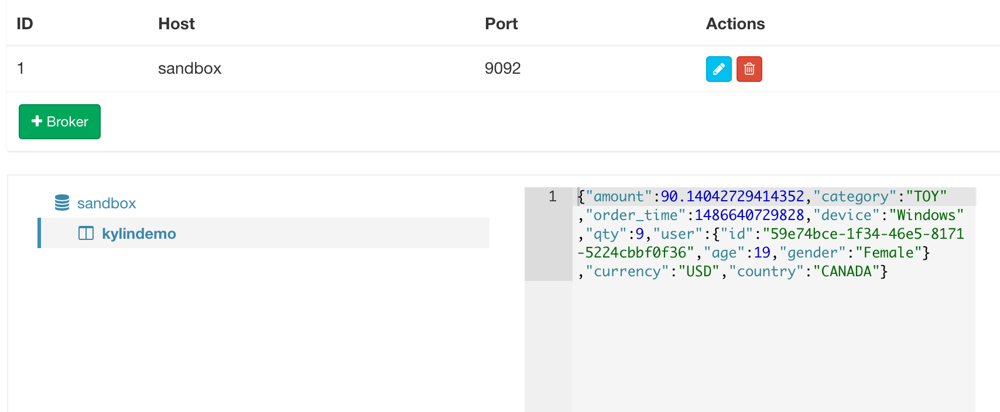
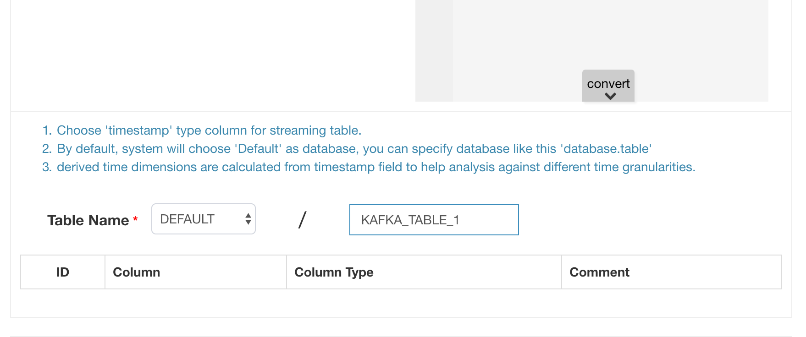
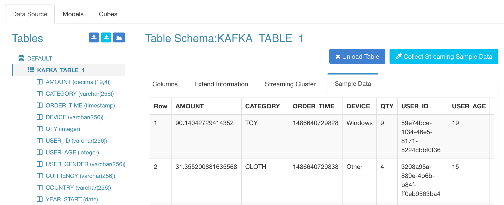

## KAP Building Cube from Streaming (Kafka)

KAP v2.3 releases the scalable streaming cubing function, it leverages Hadoop to consume the data from Kafka to build the cube. This doc is a step by step tutorial, illustrating how to create and build a sample cube.

## Preparation
To finish this tutorial, you need a Hadoop environment which has KAP2.3 installed, and have Kafka be ready to use. Previous KAP version has a couple issues so please upgrade your KAP instance at first.

In this tutorial, we will use Hortonworks HDP 2.4 Sandbox VM as the Hadoop environment.

## Create sample Kafka topic and populate data

Firstly, we need a Kafka topic for the incoming data. A sample topic "kylin_demo" will be created here:

	curl -s http://mirrors.tuna.tsinghua.edu.cn/apache/kafka/0.10.0.0/kafka_2.10-0.10.0.0.tgz | tar -xz -C /usr/local/
	cd /usr/local/kafka_2.10-0.10.0.0/
	./bin/kafka-server-start.sh config/server.properties &

Secondly, we need put to sample data to this topic. KAP has a utility class which can do this. Assuming KAP is installed in ${KYLIN_HOME}

	bin/kafka-topics.sh --create --zookeeper localhost:2181 --replication-factor 1 --partitions 3 --topic kylindemo
	Created topic "kylindemo".
	export KAFKA_HOME=/usr/local/kafka_2.10-0.10.0.0
	cd $KYLIN_HOME
	./bin/kylin.sh org.apache.kylin.source.kafka.util.KafkaSampleProducer --topic kylindemo --broker localhost:9092

This tool will send 100 records to Kafka per second. Please keep it running during this tutorial. You can check the sample message with kafka-console-consumer.sh 

	cd $KAFKA_HOME
	bin/kafka-console-consumer.sh --zookeeper localhost:2181 --bootstrap-server localhost:9092 --topic kylindemo --from-beginning

## Define a table from streaming
1. Start KAP server, login KAP web GUI, select or create a project. Click "Model" -> "Data Source", then click the icon "Add Streaming Table".

   

2.Input your broker info and save it, like:
   

3.Click sandbox->kylindemo, the kafka message sample would appear in the right box:
   

4.You need to give a logic table name for this streaming data source. The name will be used for SQL query later. Here please enter "KAFKA_TABLE_1" in the "Table Name" field.
   

5.Review the table schema and submit it!

   

## Create data model
With the table defined in previous step, let's create the data model. The step is pretty same as creating a normal data model, but please note:

* For a streaming cube, it doesn't support joining with lookup tables. So when you define the data model, only select "DEFAULT.KAFKA_TABLE_1 " as the fact table, no lookup tables.
* Select "MINUTE_START" as the cube's partition date column, as we will do incremental building at minute level.

Here we pick 8 dimension columns and 2 measure columns:
 

 	

 	
	
Save the data model.

## Create cube

The streaming cube is almost the same as a normal cube. A couple of points need your attention here:

* Don't use "order\_time" as dimension as that is pretty fine-grained, here we suggest to use "mintue\_start", "hour\_start" or other, depending on how you will inspect the data.
* In the "refersh setting" step, you should create more merge ranges, like 0.5 hour, 4 hours, 1 day, and 7 days. This will help control the cube segment amount.
* In the "rowkeys" section, drag the "minute\_start" to the head position. For streaming queries, the time condition is used frequently. So putting it to the head will help narrow down the scan range.

	
	
	
		
	

	

Save the cube.

## Run a build

You can trigger the build job from web GUI, by clicking “Actions” -> “Build”, or sending a request to Kylin RESTful API with ‘curl’ command:

	curl -X PUT --user ADMIN:KYLIN -H "Content-Type: application/json;charset=utf-8" -d '{ "sourceOffsetStart": 0, "sourceOffsetEnd": 9223372036854775807, "buildType": "BUILD"}' http://localhost:7070/kylin/api/cubes/{your_cube_name}/build2

Please note that the API endpoint is different from a normal cube (this URL end with “build2”).

Here 0 means it is from the last position, and 9223372036854775807 (Long.MAX_VALUE) means to the end position on Kafka topic. If it is the first time to build (no previous segment), Kylin will seek to beginning of the topics as the start position.

In the “Monitor” page, a new job is generated; Wait it 100% finished.

Click the “Insight” tab, compose a SQL to run, e.g:

	select minute_start, count(*), sum(amount), sum(qty) from streaming_sales_table group by minute_start order by minute_start

## Automate the build

Once the first build and query got successfully, you can schedule incremental builds at a certain frequency. Kylin will record the offsets of each build; when receive a build request, it will start from the last end position, and then seek the latest offsets from Kafka. With the REST API you can trigger it with any scheduler tools like Linux cron:

crontab -e
*/5 * * * * curl -X PUT --user ADMIN:KYLIN -H "Content-Type: application/json;charset=utf-8" -d '{ "sourceOffsetStart": 0, "sourceOffsetEnd": 9223372036854775807, "buildType": "BUILD"}' http://localhost:7070/kylin/api/cubes/{your_cube_name}/build2


Now you can site down and watch the cube is automatically built from streaming. And when the cube segments accumulate to a longer time range, Kylin will automatically merge them into a larger segment.

##Trouble shootings

You may encounter the following error when run “kylin.sh”:

    Exception in thread "main" java.lang.NoClassDefFoundError: org/apache/kafka/clients/producer/Producer
    at java.lang.Class.getDeclaredMethods0(Native Method)
    at java.lang.Class.privateGetDeclaredMethods(Class.java:2615)
    at java.lang.Class.getMethod0(Class.java:2856)
    at java.lang.Class.getMethod(Class.java:1668)
    at sun.launcher.LauncherHelper.getMainMethod(LauncherHelper.java:494)
    at sun.launcher.LauncherHelper.checkAndLoadMain(LauncherHelper.java:486)
    Caused by: java.lang.ClassNotFoundException: org.apache.kafka.clients.producer.Producer
    at java.net.URLClassLoader$1.run(URLClassLoader.java:366)
    at java.net.URLClassLoader$1.run(URLClassLoader.java:355)
    at java.security.AccessController.doPrivileged(Native Method)
    at java.net.URLClassLoader.findClass(URLClassLoader.java:354)
    at java.lang.ClassLoader.loadClass(ClassLoader.java:425)
    at sun.misc.Launcher$AppClassLoader.loadClass(Launcher.java:308)
    at java.lang.ClassLoader.loadClass(ClassLoader.java:358)
    ... 6 more

The reason is Kylin wasn’t able to find the proper Kafka client jars. Make sure you have properly set “KAFKA_HOME” environment variable.

    Get “killed by admin” error in the “Build Cube” step

Within a Sandbox VM, YARN may not allocate the requested memory resource to MR job, as the “inmem” cubing algorithm requests more memory resource. You can bypass this by requesting less memory: edit “conf/kylin_job_conf_inmem.xml”, change the following two parameters like this:

	<property>
        <name>mapreduce.map.memory.mb</name>
        <value>1072</value>
        <description></description>
    </property>

    <property>
        <name>mapreduce.map.java.opts</name>
        <value>-Xmx800m</value>
        <description></description>
    </property>

If there already have bunch of history messages in Kafka and you'd better not to build from the very beginning, you can trigger a call to set the current end position as the start for the cube:

	curl -X PUT --user ADMIN:KYLIN -H "Content-Type: application/json;charset=utf-8" -d '{ "sourceOffsetStart": 0, "sourceOffsetEnd": 9223372036854775807, "buildType": "BUILD"}' http://localhost:7070/kylin/api/cubes/{your_cube_name}/init_start_offsets

If some build jobs got error and you discard them, there will be a hole (or say gap) left in the Cube. Since each time Kylin will build from last position, you couldn’t expect the hole be filled by normal builds. Kylin provides API to check and fill the holes

Check holes:

	curl -X GET --user ADMINN:KYLIN -H "Content-Type: application/json;charset=utf-8" http://localhost:7070/kylin/api/cubes/{your_cube_name}/holes

If the result is an empty arrary, means there is no hole. Otherwise, trigger Kylin to fill them:

	curl -X PUT --user ADMINN:KYLIN -H "Content-Type: application/json;charset=utf-8" http://localhost:7070/kylin/api/cubes/{your_cube_name}/holes

